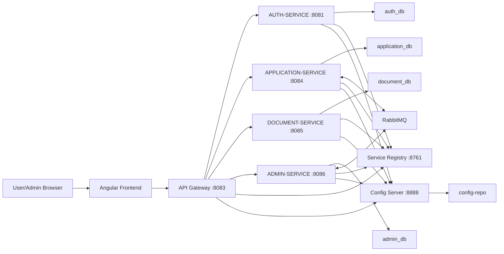
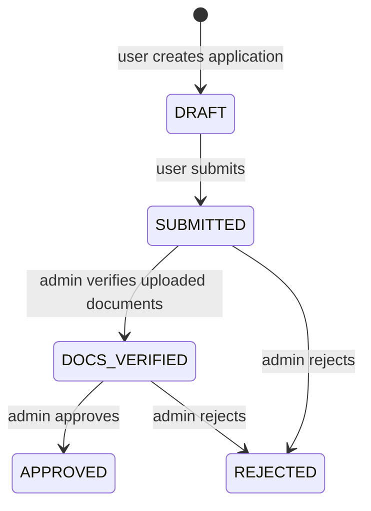

# Project Overview And Architecture

## What FinFlow Does

FinFlow is a digital loan workflow system. A normal user can create an account, log in, create a loan application draft, upload documents, submit the application, and later check the application status. An admin can log in with an admin account, view submitted applications, verify that documents exist, approve or reject applications, update admin notes, manage user roles, and see report-style summaries.

The project is built as a microservice system, not as one single backend. Each service owns a specific responsibility:

- `auth-service`: user signup, login, JWT creation, profile, password, and user roles.
- `application-service`: user-facing loan application lifecycle.
- `document-service`: file upload/download and document metadata.
- `admin-service`: admin dashboard operations and decision workflow.
- `api-gateway`: single entry point for frontend and Swagger aggregation.
- `service-registry`: Eureka server for service discovery.
- `config-server`: central configuration provider.
- `config-repo`: local configuration files loaded by config-server.
- `finflow-frontend`: Angular user interface.

## High-Level Architecture



## Why There Is An API Gateway

The frontend needs a single backend URL. Instead of calling `auth-service`, `application-service`, `document-service`, and `admin-service` separately, Angular calls the gateway.

The gateway does three critical things:

- Routes `/auth/**` and `/gateway/auth/**` to auth-service.
- Routes `/applications/**` to application-service.
- Routes `/documents/**` to document-service.
- Routes `/admin/**` to admin-service.
- Validates JWT for protected routes.
- Adds user context headers:
  - `X-User-Email`: JWT subject.
  - `X-User-Role`: JWT role claim.

Because of this, downstream services do not need to decode JWT for normal user identity. They trust headers supplied by the gateway in this local architecture.

## User Roles

There are two main roles:

- `USER`: normal applicant. Can manage their own profile, applications, and documents.
- `ADMIN`: admin reviewer. Can access `/admin/**`, verify documents, approve/reject applications, view users, update roles, and view reports.

The JWT contains:

- `sub`: the user email.
- `role`: `USER` or `ADMIN`.
- `iat`: issued-at timestamp.
- `exp`: expiration timestamp.

Angular decodes this JWT locally to decide whether to show user or admin navigation, while the backend gateway enforces access control.

## Data Ownership

Each service has its own database:

- `auth_db`: users and credentials.
- `application_db`: original user loan applications.
- `document_db`: uploaded document data.
- `admin_db`: admin-side synced copy of applications.

This matches a microservice principle: each service owns its data. The admin-service does not directly query application-service database. Instead, application-service publishes application snapshots to RabbitMQ, and admin-service stores its own copy.

## RabbitMQ Sync

RabbitMQ is used between application-service and admin-service.

When a user creates, edits, submits, or deletes an application:

- application-service publishes a message to `application_queue`.
- admin-service listens to `application_queue`.
- admin-service inserts, updates, or deletes its local admin copy.

When admin changes the status:

- admin-service publishes a message to `application_status_update_queue`.
- application-service listens to that queue.
- application-service updates the original user application status.

This is how the user side and admin side stay consistent without direct database sharing.

## Main Status Lifecycle



Important rules:

- Only `DRAFT` applications can be edited or deleted by the user.
- Only `DRAFT` applications can be submitted.
- Admin approval is allowed only after `DOCS_VERIFIED`.
- Admin rejection is allowed from `SUBMITTED` or `DOCS_VERIFIED`.
- Document verification checks that at least one document exists for that application.

## Local Ports

Direct local ports from service properties:

- `auth-service`: `8081`
- `api-gateway`: `8083`
- `application-service`: `8084`
- `document-service`: `8085`
- `admin-service`: `8086`
- `service-registry`: `8761`
- `config-server`: `8888`
- `zipkin`: `9411`
- `rabbitmq management`: `15672`

Docker Compose maps backend services to `90xx` ports externally:

- gateway: host `9083` to container `8083`
- auth: host `9081` to container `8081`
- application: host `9084` to container `8084`
- document: host `9085` to container `8085`
- admin: host `9086` to container `8086`
- frontend: host `4200` to container `80`

## Frontend Runtime Configuration

Angular uses `public/config.js`:

```js
window.__FINFLOW_CONFIG__ = window.__FINFLOW_CONFIG__ || {
  apiBaseUrl: 'http://localhost:8083',
};
```

At Docker runtime, `finflow-frontend/docker/docker-entrypoint.sh` overwrites `/usr/share/nginx/html/config.js` from the `FINFLOW_API_BASE_URL` environment variable. Docker Compose sets that to `http://localhost:9083`.

## Project Strengths

- Clear separation between user, admin, document, auth, gateway, config, and discovery concerns.
- JWT-based stateless authentication.
- Admin authorization enforced at gateway and admin-service.
- Ownership checks prevent users from reading or uploading documents for other users' applications.
- RabbitMQ creates an asynchronous sync between user applications and admin review.
- Swagger aggregation through gateway makes API testing easier.
- Angular uses modern standalone components, lazy routes, signals, computed state, guards, and interceptors.

## Limitations To Mention Honestly

- Admin notifications are frontend/localStorage based, not backend persisted.
- Uploaded document binary data is stored in PostgreSQL using `@Lob`; a real production system would usually use object storage.
- Some frontend icons/text show encoding artifacts like `→` or `📄`; this is display polish, not business logic.
- `submittedAt` appears in frontend models, but the backend entity currently does not store it.
- The admin verify endpoint path says `/admin/documents/{id}/verify`, but the `{id}` is actually the application id, not document id.

