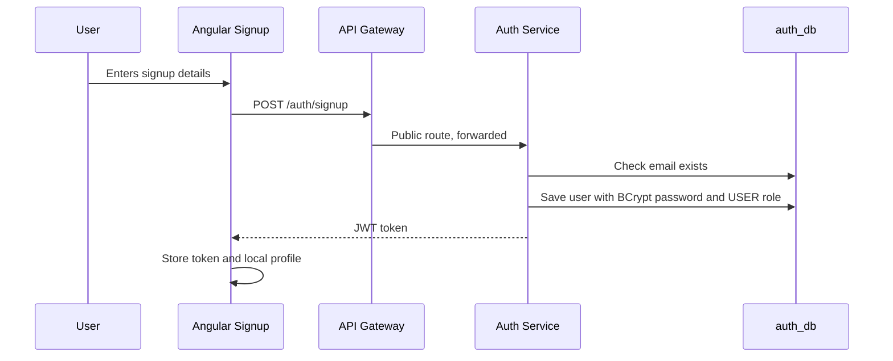
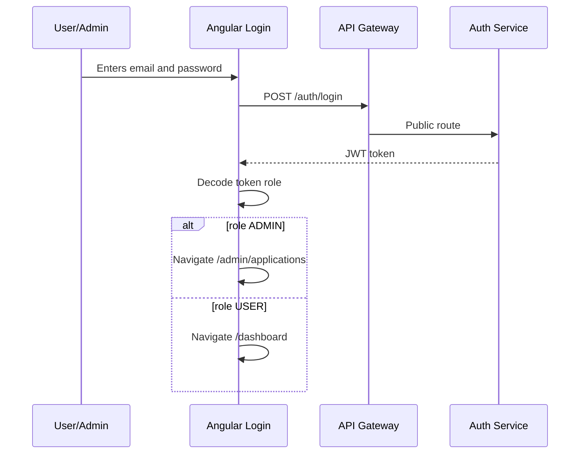
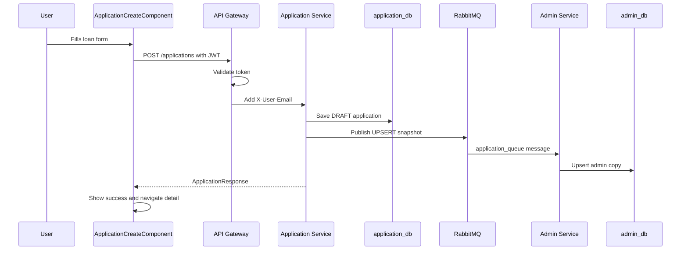
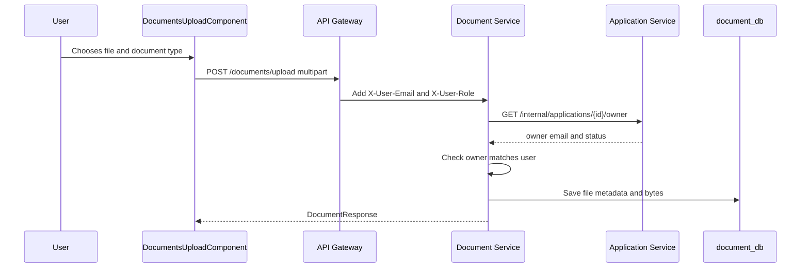
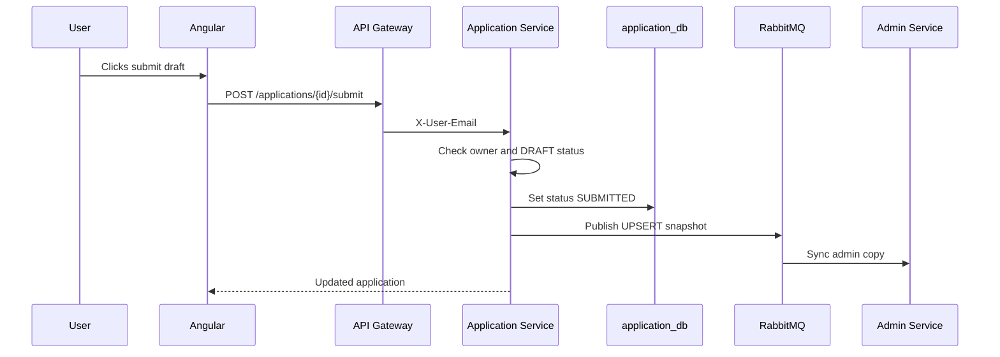
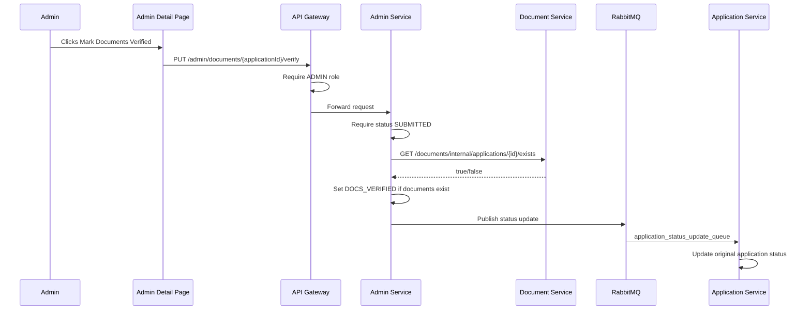
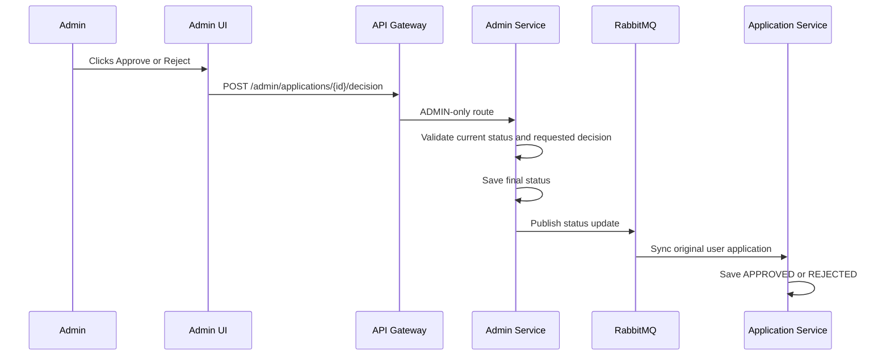
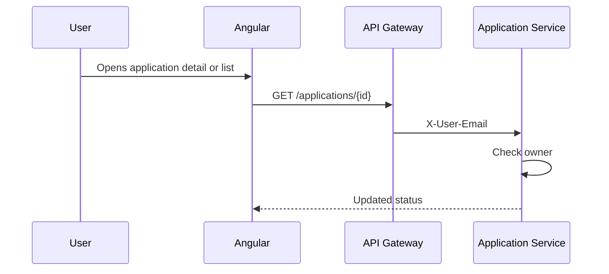
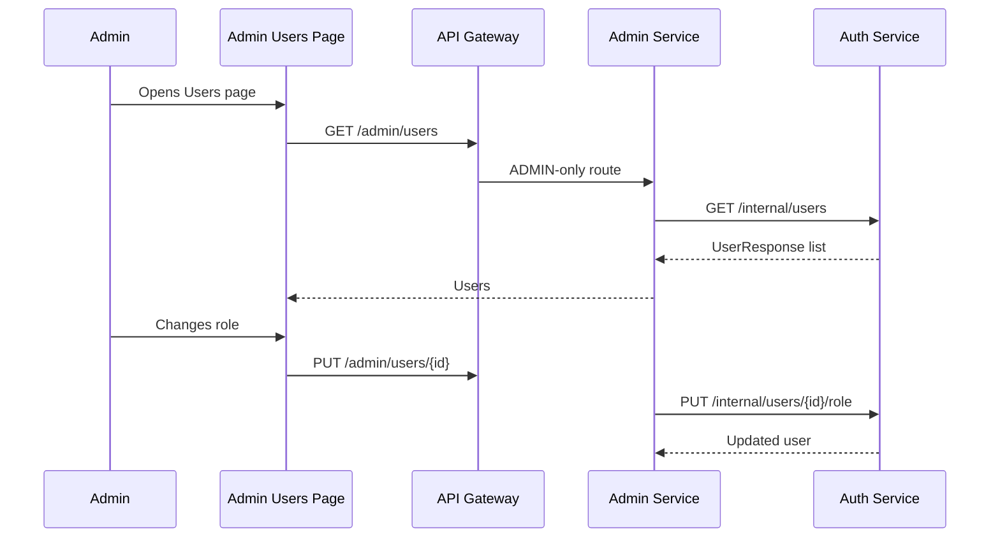

# End To End Flows

## Flow 1: User Signup

Key explanation:

- Signup is public.
- Auth-service validates email, phone, DOB, and age.
- Password is never stored as plain text. It is BCrypt encoded.
- Returned JWT logs user in immediately.

## Flow 2: Login And Role-Based Navigation

Key explanation:

- Angular decodes token for frontend navigation.
- Backend gateway still enforces security. Frontend checks are for user experience, not final security.

## Flow 3: Create Loan Draft

Key explanation:

- Application starts as `DRAFT`.
- `applicantName` is not trusted from frontend. It is taken from gateway header.
- Admin gets a copy asynchronously through RabbitMQ.

## Flow 4: Upload Supporting Document

Key explanation:

- Frontend validates type and size before upload.
- Backend validates ownership before saving.
- Files are stored in PostgreSQL as bytes.

## Flow 5: Submit Application

Key explanation:

- Once submitted, the application can no longer be edited or deleted by user.
- Admin can now start review.

## Flow 6: Admin Verifies Documents

Key explanation:

- The endpoint path uses `documents`, but id is application id.
- Verification only checks if at least one document exists.
- Status sync back to user side happens through RabbitMQ.

## Flow 7: Admin Approves Or Rejects

Rules:

- Approval requires current status `DOCS_VERIFIED`.
- Rejection can happen from `SUBMITTED` or `DOCS_VERIFIED`.
- A final application cannot be changed again.

## Flow 8: User Checks Status

Key explanation:

- The user sees final status after admin-service has published status and application-service listener has processed it.

## Flow 9: Admin User Management

Key explanation:

- Auth-service owns users and roles.
- Admin-service acts as a secure admin-facing facade.

## Flow 10: Reports

There are two report styles:

- Backend `/admin/reports` returns a summary string with status counts.
- Frontend admin reports page loads applications and computes charts locally.

Frontend computed values:

- status distribution.
- monthly application counts.
- total approved amount this month.

